# Patina: Product Specification

> A fast, lightweight, terminal-based Markdown editor written in pure Rust

**Version:** 0.1.0 (Draft)  
**Status:** Planning Phase  
**Last Updated:** January 2026

---

## 1. Vision & End Goal

### 1.1 The Dream

A **single-binary** Markdown editor that launches in milliseconds, renders everything inline in the terminal, and handles the full spectrum of modern Markdown—from simple notes to complex technical documents with diagrams, math, and structured frontmatter.

**Two interfaces, one core:**
- `patina` — Terminal UI (TUI) for SSH, servers, minimalists
- `patina-gui` — Native GUI via egui for desktop users who prefer graphics

### 1.2 Success Criteria

| Metric | Target |
|--------|--------|
| Cold start time | < 50ms |
| Memory footprint (idle) | < 20 MB |
| Binary size | < 15 MB (with all features) |
| Supported platforms | Linux, macOS, Windows |
| Zero runtime dependencies | ✓ (pure Rust, no external binaries) |

### 1.3 Core Value Proposition

```
┌─────────────────────────────────────────────────────────────────┐
│                                                                 │
│   "The Markdown editor that stays out of your way—fast enough  │
│    to feel instant, powerful enough to handle anything."        │
│                                                                 │
│             patina (TUI)  ·  patina-gui (Desktop)               │
│                                                                 │
└─────────────────────────────────────────────────────────────────┘
```

---

## 2. Target Users

| User Type | Needs | Priority |
|-----------|-------|----------|
| **Technical Writers** | YAML/TOML frontmatter, clean exports | High |
| **Developers** | Fast editing, Git-friendly, code blocks | High |
| **Researchers/Academics** | LaTeX math, citations, diagrams | High |
| **Note-takers** | Quick capture, minimal friction | Medium |
| **International Users** | Native language UI, Unicode support | Medium |

---

## 3. High-Level Architecture

### 3.1 System Overview

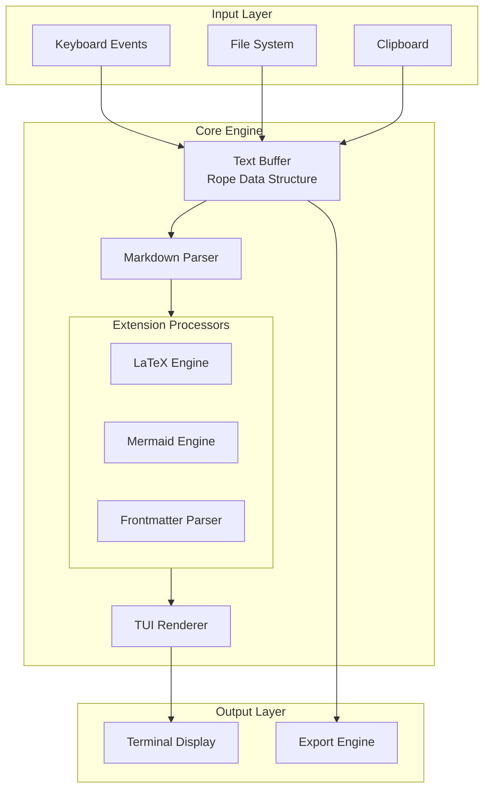

### 3.2 Module Architecture

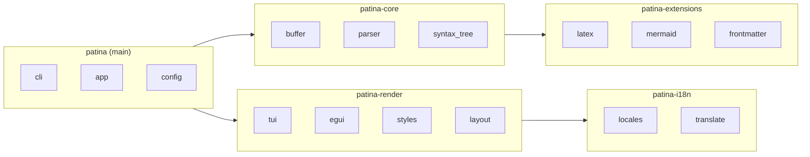

### 3.3 Data Flow

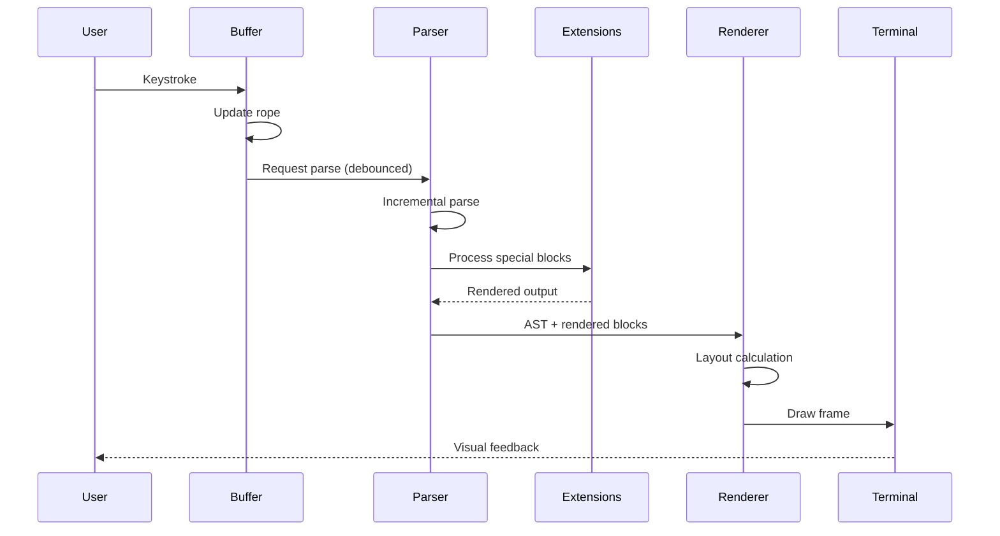

---

## 4. Feature Specification

### 4.1 Feature Matrix

| Feature | MVP | v1.0 | v2.0 | Notes |
|---------|:---:|:----:|:----:|-------|
| **Core Editing** |
| Basic text editing | ✓ | ✓ | ✓ | Insert, delete, select |
| Undo/Redo (unlimited) | ✓ | ✓ | ✓ | Branching history in v2 |
| Multiple cursors | | ✓ | ✓ | |
| Find & Replace | ✓ | ✓ | ✓ | Regex in v1.0 |
| **Markdown Support** |
| CommonMark | ✓ | ✓ | ✓ | Full spec compliance |
| GitHub Flavored MD | ✓ | ✓ | ✓ | Task lists, strikethrough, autolinks |
| Tables (GFM) | ✓ | ✓ | ✓ | Alignment, pipe syntax |
| YAML frontmatter | ✓ | ✓ | ✓ | |
| TOML frontmatter | ✓ | ✓ | ✓ | |
| Hyperlinks | ✓ | ✓ | ✓ | Inline, reference, autolinks |
| Emoji shortcodes | ✓ | ✓ | ✓ | `:rocket:` → 🚀 |
| **Extensions** |
| Inline math ($...$) | ✓ | ✓ | ✓ | |
| Display math ($$...$$) | ✓ | ✓ | ✓ | |
| Mermaid diagrams | | ✓ | ✓ | ASCII art in terminal |
| Syntax highlighting | ✓ | ✓ | ✓ | 50+ languages |
| **UI/UX** |
| Colored TUI | ✓ | ✓ | ✓ | 16/256/TrueColor |
| Split panes | ✓ | ✓ | ✓ | Edit + Preview |
| Sync scrolling | ✓ | ✓ | ✓ | Bidirectional in split view |
| Zen Mode | | ✓ | ✓ | Distraction-free centered writing |
| Minimap | | ✓ | ✓ | VS Code-style code overview |
| Document outline | ✓ | ✓ | ✓ | Header-based navigation |
| File tree | | ✓ | ✓ | Workspace mode |
| Fuzzy file finder | | ✓ | ✓ | Ctrl+P quick switcher |
| Search in files | | ✓ | ✓ | Ctrl+Shift+F across project |
| **Editor Productivity** |
| Code folding | | ✓ | ✓ | Collapse headings, code blocks |
| Bracket matching | ✓ | ✓ | ✓ | Highlight matching pairs |
| Auto-close brackets | ✓ | ✓ | ✓ | Smart pair completion |
| Go to line (Ctrl+G) | ✓ | ✓ | ✓ | Quick navigation |
| Duplicate line | ✓ | ✓ | ✓ | Ctrl+Shift+D |
| Move line up/down | ✓ | ✓ | ✓ | Alt+↑/↓ |
| Smart link paste | ✓ | ✓ | ✓ | Select + paste URL → `[text](url)` |
| **Session & Files** |
| Session persistence | | ✓ | ✓ | Restore tabs, cursors, scroll |
| Recent files | ✓ | ✓ | ✓ | Quick history access |
| Auto-save | ✓ | ✓ | ✓ | Configurable interval |
| File watching | | ✓ | ✓ | Hot reload on external changes |
| **Git Integration** |
| Status indicators | | ✓ | ✓ | Modified/added/untracked markers |
| Diff preview | | | ✓ | Inline change highlighting |
| **I18n** |
| English | ✓ | ✓ | ✓ | |
| i18n framework | ✓ | ✓ | ✓ | Fluent-based |
| 5+ languages | | ✓ | ✓ | Community-driven |
| **Export** |
| HTML | ✓ | ✓ | ✓ | |
| PDF (via HTML) | | ✓ | ✓ | |
| Plain text | ✓ | ✓ | ✓ | |

### 4.2 TUI vs GUI Feature Comparison

| Feature | `patina` (TUI) | `patina-gui` (egui) |
|---------|:--------------:|:-------------------:|
| **Rendering** |
| Mermaid diagrams | ASCII/Unicode art | True vector graphics |
| LaTeX math | Unicode approximation | Rendered equations |
| Images in preview | Sixel (if supported) | Native image display |
| Tables | Box-drawing chars | Styled HTML-like |
| Emoji | Native Unicode 🚀 | Native Unicode 🚀 |
| **Hyperlinks** |
| Display | Underlined + colored | Underlined + colored |
| Click to open | OSC 8 (modern terms) | Native browser launch |
| Hover preview | ✗ | ✓ Tooltip with URL |
| **Platform** |
| SSH/remote | ✓ | ✗ |
| Headless servers | ✓ | ✗ |
| Desktop (Linux) | ✓ | ✓ |
| Desktop (macOS) | ✓ | ✓ |
| Desktop (Windows) | ✓ | ✓ |
| **UX Enhancements** |
| Mouse support | Basic | Full |
| Drag & drop files | ✗ | ✓ |
| System clipboard | Via terminal | Native |
| Font customization | Terminal font | Any system font |
| Zoom | ✗ | ✓ |
| **Binary Size** | ~8 MB | ~15 MB |
| **Startup Time** | < 50ms | < 300ms |

### 4.3 Markdown Dialect Support

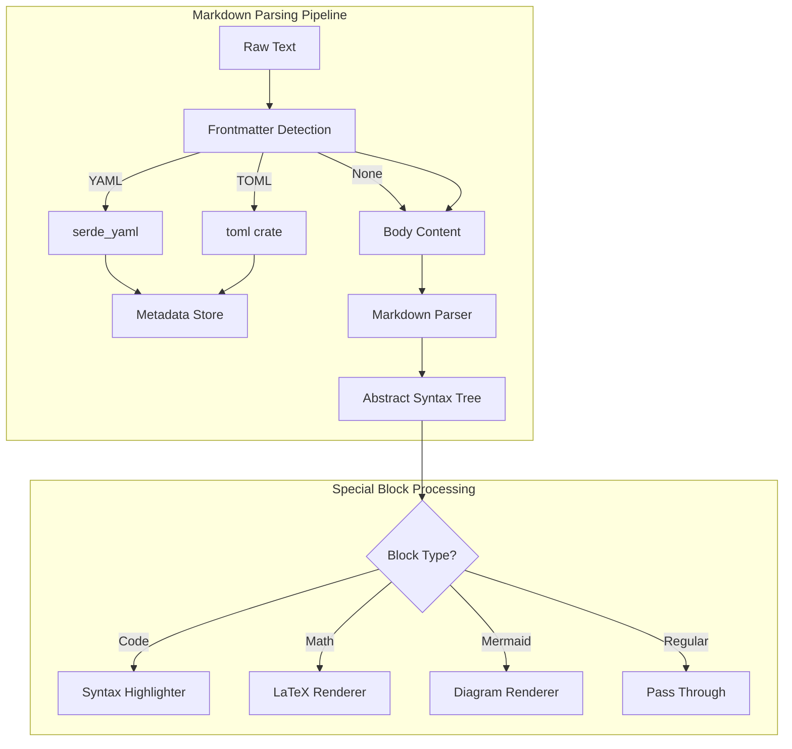

**Supported Frontmatter Formats:**

```yaml
# YAML Style
---
title: "Document Title"
author: "Name"
date: 2026-01-13
tags: [rust, markdown]
---
```

```toml
# TOML Style
+++
title = "Document Title"
author = "Name"
date = 2026-01-13
tags = ["rust", "markdown"]
+++
```

### 4.4 LaTeX Math Rendering

**Approach:** Pure Rust implementation rendering to Unicode/ASCII art for terminal display.

| Input | Terminal Output |
|-------|-----------------|
| `$x^2$` | x² |
| `$\sqrt{x}$` | √x |
| `$\frac{a}{b}$` | ᵃ⁄ᵦ or a/b |
| `$\sum_{i=0}^{n}$` | Σᵢ₌₀ⁿ |

**Display Math Block:**
```
$$
E = mc^2
$$
```
Renders as centered, boxed formula in terminal.

### 4.5 Mermaid Diagram Rendering

**Approach:** Parse Mermaid DSL → Internal graph representation → ASCII/Unicode art.

**Supported Diagram Types (v1.0):**

| Type | Support Level | Terminal Rendering |
|------|---------------|-------------------|
| Flowchart | Full | Box-drawing characters |
| Sequence | Full | ASCII arrows & boxes |
| Class | Partial | Simplified layout |
| State | Full | State boxes with transitions |
| Gantt | Partial | Horizontal bar representation |
| Pie | Basic | Percentage bars |

**Example Terminal Rendering:**

```
┌─────────┐     ┌─────────┐     ┌─────────┐
│  Start  │────▶│ Process │────▶│   End   │
└─────────┘     └─────────┘     └─────────┘
```

### 4.6 Table Rendering

**Approach:** Parse GFM pipe tables → Render with Unicode box-drawing characters.

**Input:**
```markdown
| Feature | Status | Priority |
|:--------|:------:|----------|
| Tables  | ✓      | High     |
| Emoji   | ✓      | Medium   |
```

**TUI Output:**
```
┌──────────┬────────┬──────────┐
│ Feature  │ Status │ Priority │
├──────────┼────────┼──────────┤
│ Tables   │   ✓    │ High     │
│ Emoji    │   ✓    │ Medium   │
└──────────┴────────┴──────────┘
```

**Table Features:**

| Feature | MVP | v1.0 | Notes |
|---------|:---:|:----:|-------|
| Basic pipe tables | ✓ | ✓ | Standard GFM syntax |
| Column alignment | ✓ | ✓ | Left, center, right |
| Auto-width columns | ✓ | ✓ | Content-aware sizing |
| Syntax highlighting in cells | | ✓ | Inline code in tables |
| Table editing helpers | | ✓ | Auto-align, add row/col |

### 4.7 Hyperlink Handling

**Supported Link Types:**

| Type | Syntax | Example |
|------|--------|---------|
| Inline | `[text](url)` | `[Rust](https://rust-lang.org)` |
| Reference | `[text][ref]` | `[Rust][1]` with `[1]: https://...` |
| Autolink | `<url>` | `<https://rust-lang.org>` |
| GFM Autolink | bare URL | `https://rust-lang.org` |
| Email | `<email>` | `<user@example.com>` |

**Terminal Behavior:**

```
┌─────────────────────────────────────────────────────────────────────┐
│ Hyperlink Rendering in TUI                                          │
├─────────────────────────────────────────────────────────────────────┤
│                                                                     │
│  Check out [Rust](https://rust-lang.org) for more info.            │
│                    ^^^^                                             │
│              Rendered as: underlined + cyan                         │
│                                                                     │
│  Modern terminals (iTerm2, Kitty, WezTerm, Windows Terminal):       │
│  → Ctrl+Click / Cmd+Click opens URL via OSC 8 hyperlinks           │
│                                                                     │
│  Legacy terminals:                                                  │
│  → Press 'gx' (vim-style) to open link under cursor                │
│  → Or use `:open-link` command                                      │
│                                                                     │
└─────────────────────────────────────────────────────────────────────┘
```

**GUI Behavior (`patina-gui`):**
- Clickable links with hand cursor
- Hover tooltip shows full URL
- Opens in system default browser

### 4.8 Emoji Support

**Implementation:** Unicode-native with shortcode expansion.

| Input Method | Example | Output |
|--------------|---------|--------|
| Shortcode | `:rocket:` | 🚀 |
| Shortcode | `:heavy_check_mark:` | ✔️ |
| Unicode direct | `🎉` | 🎉 |
| GitHub-style | `:+1:` | 👍 |

**Features:**

| Feature | MVP | v1.0 | Notes |
|---------|:---:|:----:|-------|
| Unicode emoji display | ✓ | ✓ | Requires Unicode-capable terminal |
| Shortcode → emoji | ✓ | ✓ | On render/export |
| Shortcode autocomplete | | ✓ | Fuzzy search popup |
| Emoji picker (GUI) | | ✓ | `patina-gui` only |
| Skin tone modifiers | | ✓ | `:wave::skin-tone-3:` |

**Shortcode Database:** ~1,800 emoji from Unicode 15.0, compatible with GitHub/Slack shortcodes.

**Terminal Considerations:**
- Emoji width detection (some are double-width)
- Fallback for terminals without emoji support (`:rocket:` stays as text)
- Configurable: `render_emoji = true | false`

### 4.9 Code Block Syntax Highlighting

**Implementation:** `syntect` crate with `tree-sitter` grammars for accurate, fast highlighting.

**Fenced Code Block Syntax:**
~~~markdown
```rust
fn main() {
    println!("Hello, Patina!");
}
```
~~~

**TUI Rendering Example:**
```
┌─ rust ──────────────────────────────────────┐
│ fn main() {                                 │
│     println!("Hello, Patina!");             │
│ }                                           │
└─────────────────────────────────────────────┘
```
With semantic colors: keywords (magenta), strings (green), functions (blue), etc.

**Supported Languages (MVP - 50+):**

| Category | Languages |
|----------|-----------|
| Systems | Rust, C, C++, Go, Zig |
| Web | JavaScript, TypeScript, HTML, CSS, JSON |
| Scripting | Python, Ruby, Lua, Bash, PowerShell |
| Data | SQL, YAML, TOML, XML, GraphQL |
| JVM | Java, Kotlin, Scala |
| Functional | Haskell, OCaml, Elixir, Clojure |
| Scientific | R, Julia, MATLAB |
| Config | Dockerfile, Makefile, Nginx, .env |
| Markup | Markdown, LaTeX, reStructuredText |

**Features:**

| Feature | MVP | v1.0 | Notes |
|---------|:---:|:----:|-------|
| Language detection | ✓ | ✓ | Via fence info string |
| Auto-detect (no fence) | | ✓ | Heuristic-based |
| Line numbers | ✓ | ✓ | Configurable |
| Line highlighting | | ✓ | `{1,3-5}` syntax |
| Copy code button (GUI) | | ✓ | `patina-gui` only |
| Custom themes | | ✓ | Base16 compatible |

**Theme Support:**
- Ships with: Dracula, One Dark, Solarized, Nord, Gruvbox
- Custom themes via `~/.config/patina/themes/`

### 4.10 Zen Mode

**Purpose:** Distraction-free writing environment for focused content creation.

**TUI Behavior:**
```
┌─────────────────────────────────────────────────────────────────────┐
│                                                                     │
│                                                                     │
│                    # My Document                                    │
│                                                                     │
│                    The quick brown fox jumps over                   │
│                    the lazy dog. This is focused                    │
│                    writing without distractions.                    │
│                                                                     │
│                    ## Section Two                                   │
│                                                                     │
│                    More content here...                             │
│                                                                     │
│                                                                     │
└─────────────────────────────────────────────────────────────────────┘
```

**Features:**
- Centered text column (configurable width: 60-100 chars)
- Hidden status bar, line numbers, panels
- Soft ambient background
- Toggle: `Ctrl+Shift+Z` or `:zen`
- ESC twice to exit

### 4.11 Minimap

**Purpose:** VS Code-style bird's-eye view for quick navigation in large documents.

**TUI Rendering:**
```
┌─ Editor ─────────────────────────────────┬─ Minimap ─┐
│ # Introduction                           │ ░░░░░░░░░ │
│                                          │ ░▓▓▓░░░░░ │ ← viewport
│ Lorem ipsum dolor sit amet...            │ ░░░░░░░░░ │
│                                          │ ░░░███░░░ │ ← search hits
│ ## Methods                               │ ░░░░░░░░░ │
│                                          │ ░░░░░░░░░ │
│ The approach involves...                 │ ░░░░░░░░░ │
└──────────────────────────────────────────┴───────────┘
```

**Features:**

| Feature | MVP | v1.0 | Notes |
|---------|:---:|:----:|-------|
| Document overview | | ✓ | Compressed text representation |
| Click to jump | | ✓ | Navigate to position |
| Viewport indicator | | ✓ | Shows current view |
| Search highlights | | ✓ | Show match positions |
| Syntax coloring | | ✓ | Reflect code colors |
| Configurable width | | ✓ | 50-120px |

### 4.12 Workspace Mode

**Purpose:** Project-based editing with file tree, search, and git integration.

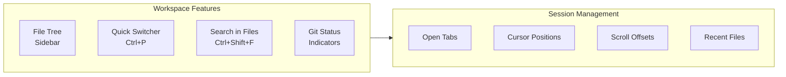

**File Tree:**
```
┌─ ~/project ─────────────┐
│ 📁 src                  │
│   📄 main.rs        [M] │  ← Modified
│   📄 lib.rs             │
│ 📁 docs                 │
│   📄 README.md      [+] │  ← Staged
│   📄 SPEC.md        [?] │  ← Untracked
│ 📄 Cargo.toml           │
│ 📄 .gitignore       [I] │  ← Ignored
└─────────────────────────┘
```

**Git Status Indicators:**

| Indicator | Meaning |
|-----------|---------|
| `[M]` | Modified (unstaged) |
| `[+]` | Staged for commit |
| `[?]` | Untracked |
| `[I]` | Ignored |
| `[D]` | Deleted |
| `[R]` | Renamed |

**Quick Switcher (Ctrl+P):**
- Fuzzy file search across workspace
- Recent files prioritized
- Preview on hover (GUI) or highlight (TUI)

**Search in Files (Ctrl+Shift+F):**
- Regex support
- Include/exclude patterns
- Results grouped by file

---

## 5. Technical Stack

### 5.1 Crate Dependencies

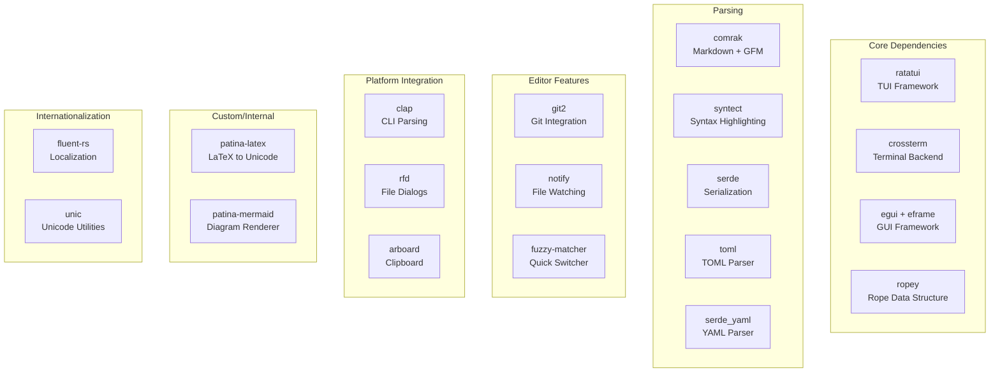

**Full Dependency Table:**

| Crate | Version | Purpose |
|-------|---------|---------|
| ratatui | 0.28+ | TUI framework |
| crossterm | 0.27+ | Terminal backend |
| egui/eframe | 0.28+ | GUI framework (patina-gui) |
| ropey | 1.6+ | Rope data structure for text buffer |
| comrak | 0.22+ | CommonMark + GFM markdown parsing |
| syntect | 5.1+ | Syntax highlighting (40+ languages) |
| git2 | 0.19+ | Git status integration |
| notify | 6+ | File system watching |
| fuzzy-matcher | 0.3+ | Fuzzy search for Ctrl+P |
| clap | 4+ | CLI argument parsing |
| rfd | 0.14+ | Native file dialogs |
| arboard | 3+ | Cross-platform clipboard |
| fluent-rs | 0.16+ | i18n localization |
| serde | 1+ | Serialization framework |
| toml | 0.8+ | TOML parsing |
| serde_yaml | 0.9+ | YAML parsing |

### 5.2 Key Technical Decisions

| Decision | Choice | Rationale |
|----------|--------|-----------|
| Text buffer | Rope (ropey) | O(log n) edits, handles large files |
| TUI framework | ratatui | Active community, Crossterm backend |
| GUI framework | egui/eframe | Immediate-mode, pure Rust, fast iteration |
| Markdown parser | comrak | GFM built-in, CommonMark compliant, battle-tested |
| Syntax highlighting | syntect | 40+ languages, theme support |
| Git integration | git2 | libgit2 bindings, status indicators |
| Config format | TOML | Rust ecosystem standard |
| i18n system | Fluent | Mozilla standard, natural syntax |
| CLI parsing | clap | Derive macros, shell completions |
| Async runtime | tokio (optional) | File I/O, future LSP support |

### 5.3 Why Not egui?

**egui** is an excellent *immediate-mode GUI* library for Rust. For Patina, we use it strategically:

```
┌─────────────────────────────────────────────────────────────────────┐
│                    TUI (ratatui) vs GUI (egui)                      │
├─────────────────────┬─────────────────────┬─────────────────────────┤
│ Aspect              │ patina (ratatui)    │ patina-gui (egui)       │
├─────────────────────┼─────────────────────┼─────────────────────────┤
│ Target              │ Terminal/console    │ Desktop GUI windows     │
│ Rendering           │ Text cells (ANSI)   │ GPU (OpenGL/wgpu)       │
│ Dependencies        │ None (pure terminal)│ Graphics drivers        │
│ SSH-friendly        │ ✓ Yes               │ ✗ No                    │
│ Headless servers    │ ✓ Yes               │ ✗ No                    │
│ Rich preview        │ ASCII/Unicode art   │ True rendered output    │
│ Startup time        │ ~10-50ms            │ ~100-300ms              │
│ Use case            │ Dev servers, SSH    │ Desktop writing         │
└─────────────────────┴─────────────────────┴─────────────────────────┘
```

**Patina's dual-backend strategy:**
- `patina` (TUI): Works over SSH, in tmux, on headless servers—the core experience
- `patina-gui`: Native desktop app with true Mermaid/LaTeX rendering for visual users

Both share `patina-core`, ensuring identical editing behavior.

### 5.4 Performance Strategy

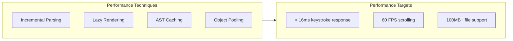

---

## 6. User Interface Design

### 6.1 Screen Layout

```
┌─────────────────────────────────────────────────────────────────────┐
│ Patina │ document.md │ Modified │ UTF-8 │ LF │ Ln 42, Col 15 │ EN │
├─────────────────────────────────────────────────────────────────────┤
│                                                                     │
│  # My Document                                                      │
│                                                                     │
│  This is a paragraph with **bold** and *italic* text.              │
│                                                                     │
│  ## Math Example                                                    │
│                                                                     │
│  The quadratic formula: x = (-b ± √(b²-4ac)) / 2a                  │
│                                                                     │
│  ```rust                                                            │
│  fn main() {                                                        │
│      println!("Hello, world!");                                     │
│  }                                                                  │
│  ```                                                                │
│                                                                     │
│  ```mermaid                                                         │
│  ┌───────┐    ┌───────┐    ┌───────┐                               │
│  │   A   │───▶│   B   │───▶│   C   │                               │
│  └───────┘    └───────┘    └───────┘                               │
│  ```                                                                │
│                                                                     │
├─────────────────────────────────────────────────────────────────────┤
│ NORMAL │ :help for commands │ ██████████░░░░░░░░░░ 42% │           │
└─────────────────────────────────────────────────────────────────────┘
```

### 6.2 Color Scheme System

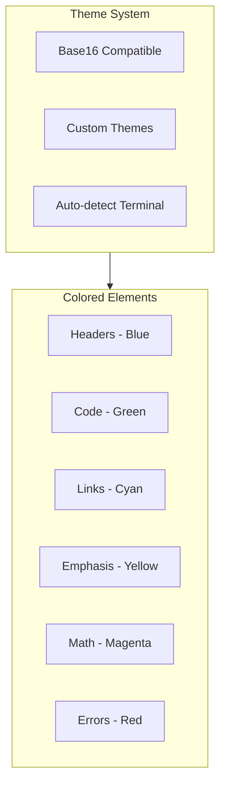

### 6.3 Keybinding Philosophy

**Modal Editing (Vim-inspired, optional):**

| Mode | Purpose | Indicator |
|------|---------|-----------|
| NORMAL | Navigation, commands | `[N]` |
| INSERT | Text entry | `[I]` |
| VISUAL | Selection | `[V]` |
| COMMAND | Ex commands | `:` |

**Non-modal Option:** Emacs-style or standard editor bindings available via config.

### 6.4 Keyboard Shortcuts

**File Operations:**

| Shortcut | Action |
|----------|--------|
| `Ctrl+N` | New file |
| `Ctrl+O` | Open file |
| `Ctrl+S` | Save file |
| `Ctrl+Shift+S` | Save as |
| `Ctrl+W` | Close tab |

**Navigation:**

| Shortcut | Action |
|----------|--------|
| `Ctrl+G` | Go to line |
| `Ctrl+P` | Quick file switcher (workspace) |
| `Ctrl+Tab` | Next tab |
| `Ctrl+Shift+Tab` | Previous tab |
| `Ctrl+Home` | Go to start of document |
| `Ctrl+End` | Go to end of document |

**Editing:**

| Shortcut | Action |
|----------|--------|
| `Ctrl+Z` | Undo |
| `Ctrl+Y` / `Ctrl+Shift+Z` | Redo |
| `Ctrl+F` | Find |
| `Ctrl+H` | Find and replace |
| `Ctrl+Shift+F` | Search in files (workspace) |
| `Ctrl+Shift+D` | Duplicate line |
| `Alt+↑` | Move line up |
| `Alt+↓` | Move line down |
| `Ctrl+/` | Toggle comment |

**Formatting (Markdown):**

| Shortcut | Action |
|----------|--------|
| `Ctrl+B` | Bold |
| `Ctrl+I` | Italic |
| `Ctrl+K` | Insert link |
| `Ctrl+Shift+K` | Insert image |
| `Ctrl+1` to `Ctrl+6` | Heading levels |

**View:**

| Shortcut | Action |
|----------|--------|
| `F11` | Toggle fullscreen |
| `Ctrl+Shift+Z` | Toggle Zen mode |
| `Ctrl+\` | Toggle split view |
| `Ctrl+,` | Open settings |
| `Ctrl+Shift+[` | Fold all |
| `Ctrl+Shift+]` | Unfold all |

---

## 7. Internationalization

### 7.1 i18n Architecture

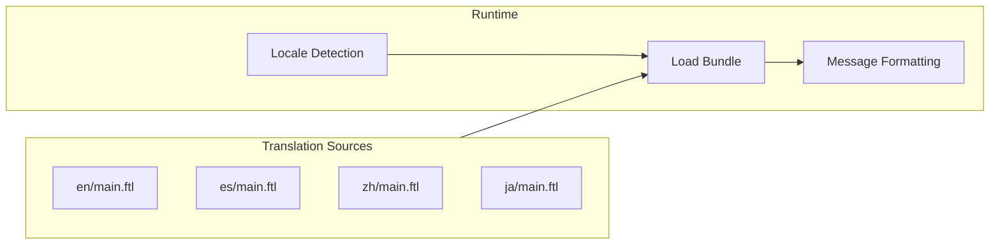

### 7.2 Fluent Message Examples

```ftl
# en/main.ftl
app-title = Patina
file-saved = File saved: { $filename }
unsaved-changes = You have { $count ->
    [one] one unsaved change
   *[other] { $count } unsaved changes
}
```

### 7.3 Supported Locales (v1.0 Target)

| Language | Code | Status |
|----------|------|--------|
| English | en | ✓ Built-in |
| Hindi (Devanagari) | hi | Planned (Priority) |
| Spanish | es | Planned |
| Chinese (Simplified) | zh-CN | Planned |
| Japanese | ja | Planned |
| German | de | Planned |
| French | fr | Planned |

---

## 8. Export Engine

### 8.1 Export Formats

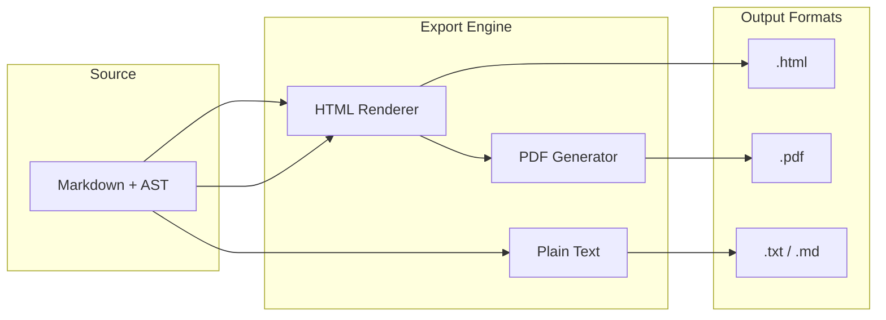

### 8.2 HTML Export

**Command:** `patina export document.md --format html`

**Features:**

| Feature | MVP | v1.0 | Notes |
|---------|:---:|:----:|-------|
| Semantic HTML5 | ✓ | ✓ | `<article>`, `<section>`, etc. |
| Syntax-highlighted code | ✓ | ✓ | Inline CSS or classes |
| Embedded CSS | ✓ | ✓ | Self-contained output |
| External stylesheet | | ✓ | `--stylesheet custom.css` |
| Table of contents | | ✓ | Auto-generated from headers |
| Mermaid → SVG | | ✓ | Rendered diagrams |
| LaTeX → MathML/SVG | | ✓ | Accessible math |
| Dark mode support | | ✓ | `prefers-color-scheme` |

**Output Example:**
```html
<!DOCTYPE html>
<html lang="en">
<head>
  <meta charset="UTF-8">
  <title>Document Title</title>
  <style>/* embedded or linked */</style>
</head>
<body>
  <article>
    <h1>Document Title</h1>
    <p>Content with <strong>bold</strong> and <a href="...">links</a>.</p>
    <pre><code class="language-rust">fn main() {}</code></pre>
  </article>
</body>
</html>
```

### 8.3 PDF Export

**Command:** `patina export document.md --format pdf`

**Approach:** HTML → PDF via embedded headless renderer (no external dependencies).

| Feature | MVP | v1.0 | Notes |
|---------|:---:|:----:|-------|
| Basic PDF generation | | ✓ | Via `weasyprint` or `printpdf` |
| Page size options | | ✓ | A4, Letter, custom |
| Headers/footers | | ✓ | Page numbers, title |
| Cover page | | ✓ | From frontmatter |
| PDF/A compliance | | v2.0 | Archival format |

**Configuration:**
```toml
[export.pdf]
page_size = "letter"  # or "a4", "legal"
margin = "1in"
header = "{title}"
footer = "Page {page} of {pages}"
font_family = "Inter"
```

### 8.4 Plain Text / Markdown Export

**Use Cases:**
- Strip formatting for clipboard
- Normalize to CommonMark from GFM
- Extract plain text for indexing

**Command:** `patina export document.md --format txt`

---

## 9. Configuration

### 8.1 Config File Structure

```toml
# ~/.config/patina/config.toml

[editor]
tab_size = 4
soft_wrap = true
line_numbers = true
theme = "dracula"

[keybindings]
mode = "vim"  # or "emacs", "standard"

[markdown]
default_parser = "commonmark"  # or "gfm"
math_engine = "unicode"        # or "ascii"

[i18n]
locale = "auto"  # or specific locale code

[export]
default_format = "html"
stylesheet = "~/.config/patina/export.css"

[mermaid]
style = "unicode"  # or "ascii"
max_width = 80
```

---

## 10. Development Roadmap

### 10.1 Milestone Timeline

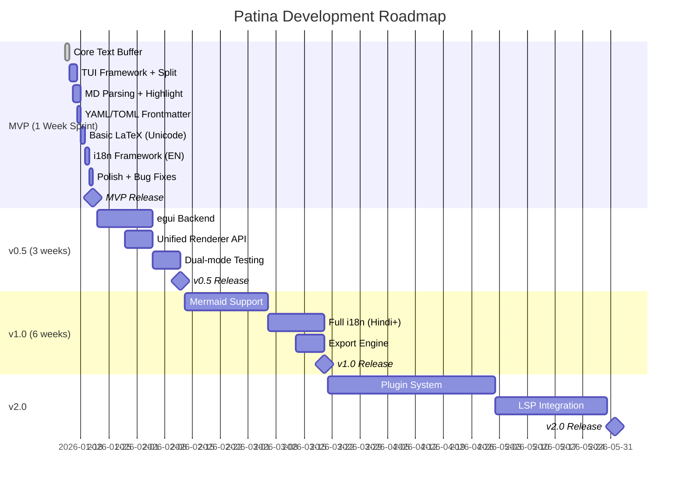

### 10.2 Version Summary

| Version | Timeline | Key Features |
|---------|----------|--------------|
| **MVP** | 1 week | TUI editor, split preview, frontmatter, basic LaTeX |
| **v0.5** | +3 weeks | egui GUI backend (optional), unified render API |
| **v1.0** | +6 weeks | Mermaid diagrams, full i18n, export engine |
| **v2.0** | +10 weeks | Plugin system, LSP integration |

### 10.3 MVP Sprint Plan (1 Week)

| Day | Focus | Deliverable |
|-----|-------|-------------|
| **Day 1** | Foundation | Rope buffer, file I/O, basic TUI shell |
| **Day 2** | TUI Core | Split pane layout, viewport scrolling |
| **Day 3** | Parsing | Markdown parser integration, AST |
| **Day 4** | Rendering | Syntax highlighting, live preview |
| **Day 5** | Frontmatter | YAML/TOML detection + parsing |
| **Day 6** | Math + i18n | LaTeX→Unicode, Fluent setup |
| **Day 7** | Polish | Keybindings, config, bug fixes |

**MVP Scoping for 1-Week Delivery:**

| In Scope | Descoped to v1.0 |
|----------|------------------|
| Single-file editing | Multi-file / tabs |
| Basic split preview | Synchronized scroll |
| CommonMark parsing | Full GFM extensions |
| Inline math only | Display math blocks |
| 3 themes | Custom theme engine |
| Vim keybindings | Emacs/Standard modes |

---

## 11. Risk Assessment

| Risk | Likelihood | Impact | Mitigation |
|------|------------|--------|------------|
| Mermaid complexity | High | Medium | Start with subset (flowcharts only) |
| LaTeX edge cases | Medium | Low | Graceful fallback to raw text |
| Cross-platform terminals | Medium | High | Extensive CI testing matrix |
| Performance on large files | Low | High | Benchmark-driven development |
| i18n quality | Medium | Medium | Community translation review |

---

## 12. Success Metrics

### 12.1 Technical KPIs

| Metric | Target | Measurement |
|--------|--------|-------------|
| Startup time | < 50ms | Benchmark suite |
| Keystroke latency | < 16ms | p99 in production |
| Memory (100KB file) | < 50MB | Profiling |
| Test coverage | > 80% | CI metrics |
| Clippy warnings | 0 | CI gate |

### 12.2 User Adoption KPIs

| Metric | 6-month Target |
|--------|----------------|
| GitHub stars | 1,000 |
| Active users (telemetry opt-in) | 500 |
| Community translations | 3 languages |
| Reported bugs (critical) | < 5 open |

---

## 13. Appendix

### A. Competitive Analysis

| Feature | Patina | Ferrite | vim + plugins | Obsidian | Typora |
|---------|:------:|:-------:|:-------------:|:--------:|:------:|
| Terminal-native | ✓ | ✗ | ✓ | ✗ | ✗ |
| GUI version | ✓ | ✓ | ✗ | ✓ | ✓ |
| Pure Rust | ✓ | ✓ | ✗ | ✗ | ✗ |
| Single binary | ✓ | ✓ | ✗ | ✗ | ✗ |
| Mermaid (native) | ✓ | ✓ | Plugin | JS | JS |
| LaTeX math | ✓ | ✗ | Plugin | ✓ | ✓ |
| JSON/YAML tree view | ✓ | ✓ | Plugin | ✗ | ✗ |
| i18n | ✓ | ✗ | ✗ | ✓ | ✓ |
| Git integration | ✓ | ✓ | Plugin | ✗ | ✗ |
| Zen mode | ✓ | ✓ | Plugin | ✓ | ✓ |
| < 50ms startup | ✓ | ✓ | ✗ | ✗ | ✗ |
| Works over SSH | ✓ | ✗ | ✓ | ✗ | ✗ |

**Key Differentiation vs Ferrite:**
- Patina offers both TUI (`patina`) AND GUI (`patina-gui`)
- Patina includes LaTeX math rendering
- Patina has i18n support (Hindi priority)
- Ferrite is egui-only (no terminal version)

### B. Reference Documents

- CommonMark Spec: https://spec.commonmark.org/
- GitHub Flavored Markdown: https://github.github.com/gfm/
- Mermaid Documentation: https://mermaid.js.org/
- Fluent Project: https://projectfluent.org/
- Ratatui Book: https://ratatui.rs/
- Ferrite Editor (inspiration): https://github.com/OlaProeis/Ferrite
- egui Documentation: https://docs.rs/egui/
- comrak Crate: https://docs.rs/comrak/

---

*This specification is a living document. Version history tracked in Git.*
